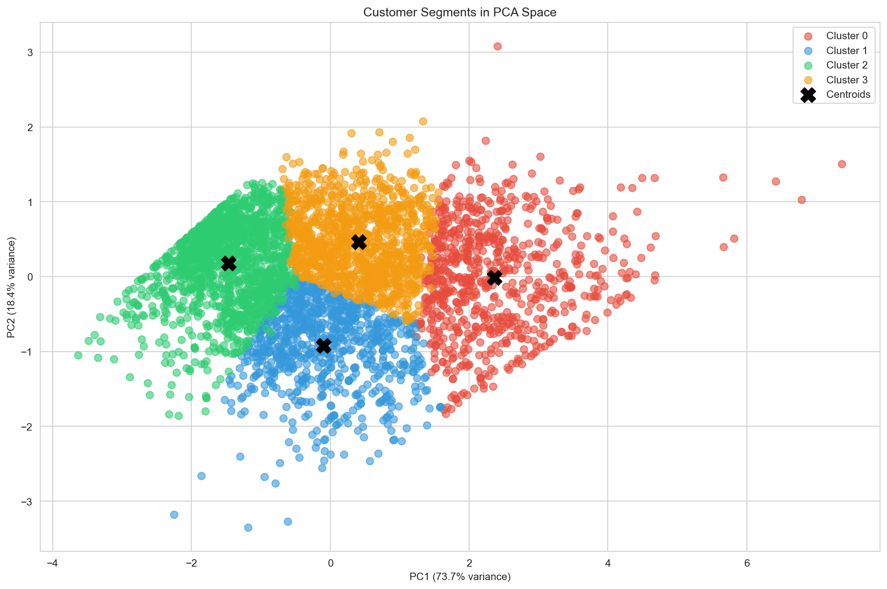
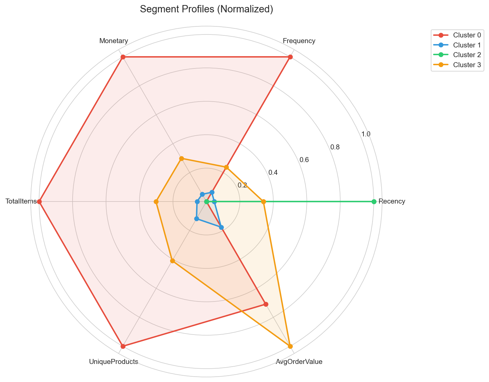
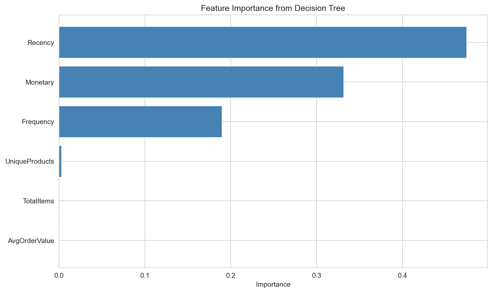
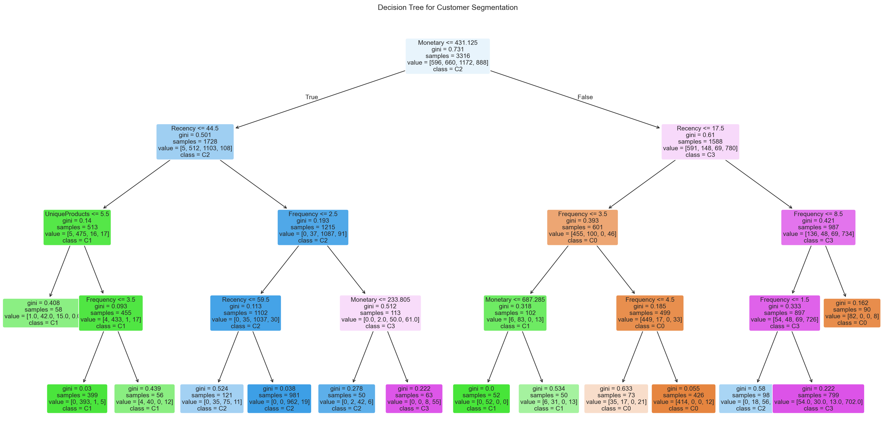

# Customer Segmentation Analysis


## 📌 Overview

This project analyzes customer purchasing behavior using **RFM (Recency, Frequency, Monetary)** analysis and **machine learning clustering techniques** to identify distinct customer segments. The insights help businesses create targeted marketing strategies and improve customer retention.

## 🎯 Business Problem

Understanding different customer groups helps businesses:
- Tailor marketing strategies to specific audiences
- Improve customer retention through targeted interventions
- Optimize resource allocation across customer segments
- Increase customer lifetime value

## 📊 Dataset

**Source:** [UCI Machine Learning Repository - Online Retail Dataset](https://archive.ics.uci.edu/ml/datasets/online+retail)

| Attribute | Description |
|-----------|-------------|
| InvoiceNo | Invoice number |
| StockCode | Product code |
| Description | Product name |
| Quantity | Quantity purchased |
| InvoiceDate | Date of purchase |
| UnitPrice | Price per unit |
| CustomerID | Unique customer identifier |
| Country | Customer's country |

**Size:** ~500,000 transactions | ~4,300 customers | Dec 2010 - Dec 2011

## 🛠️ Methodology

```
Data Cleaning → Feature Engineering → Clustering → Validation → Profiling
```

1. **Data Cleaning:** Removed missing values, cancelled orders, and outliers using IQR method
2. **Feature Engineering:** Created RFM metrics + TotalItems, UniqueProducts, AvgOrderValue
3. **Clustering:** Applied K-Means and Hierarchical clustering
4. **Validation:** Used Elbow method, Silhouette analysis, and statistical tests
5. **Profiling:** Built classification models for interpretable segment rules

## 🔍 Key Findings

### Customer Segments Identified

| Segment | Label | Customers | Characteristics | Recommendation |
|---------|-------|-----------|-----------------|----------------|
| **Cluster 0** | Champions | ~18% | Recent, frequent, high spend ($2,700 avg) | Loyalty rewards, referral programs |
| **Cluster 1** | New Customers | ~20% | Recent, low frequency ($350 avg) | Welcome offers, onboarding emails |
| **Cluster 2** | At Risk | ~35% | Inactive 190+ days, low spend ($200 avg) | Win-back campaigns, special discounts |
| **Cluster 3** | Potential Loyalists | ~27% | Moderate frequency, high order value ($290 avg) | Upselling, premium products |

### Key Insights

- **Champions (Cluster 0)** spend **13x more** than At Risk customers
- **Recency** is the most important feature (47% importance) for segmentation
- **RFM features** account for **99%** of segmentation power
- Simple rule: `Monetary > $431 AND Recency < 17 days` = Champion customer

## 📈 Visualizations

### Customer Segments in PCA Space


### Segment Profiles (Radar Chart)


### Feature Importance


### Decision Tree Rules


## 🧪 Methods & Techniques

| Category | Techniques Used |
|----------|-----------------|
| **Multivariate Statistics** | PCA, Correlation Analysis |
| **Cluster Analysis** | K-Means, Hierarchical Clustering, Silhouette Analysis |
| **Non-parametric Methods** | KDE, Kruskal-Wallis Test, Mann-Whitney U Test |
| **Classification Models** | Logistic Regression, Decision Tree |

### Statistical Validation

- **Silhouette Score:** 0.32 (reasonable cluster separation)
- **Kruskal-Wallis Test:** p < 0.001 for all features (segments are significantly different)
- **Decision Tree Accuracy:** 85%+ in predicting segment membership

## 📁 Project Structure

```
customer-segmentation-analysis/
│
├── README.md
├── requirements.txt
│
├── data/
│   ├── Online Retail.xlsx          # Raw data
│   ├── online_retail_cleaned.csv   # Cleaned data
│   ├── customer_features.csv       # Customer-level features
│   ├── customer_segmented.csv      # With cluster labels
│   └── customer_final.csv          # Final with segment names
│
├── notebooks/
│   ├── 01_data_cleaning.ipynb
│   ├── 02_exploratory_analysis.ipynb
│   ├── 03_customer_segmentation.ipynb
│   └── 04_segment_profiling.ipynb
│
├── src/
│   └── utils.py
│
└── outputs/
    ├── figures/
    └── results/
        └── segment_summary.csv
```

## 🚀 How to Run

### 1. Clone the repository
```bash
git clone https://github.com/anita2210/customer-segmentation-analysis.git
cd customer-segmentation-analysis
```

### 2. Install dependencies
```bash
pip install -r requirements.txt
```

### 3. Download the dataset
- Download from [UCI Repository](https://archive.ics.uci.edu/ml/datasets/online+retail)
- Place `Online Retail.xlsx` in the `data/` folder

### 4. Run notebooks in order
```
01_data_cleaning.ipynb → 02_exploratory_analysis.ipynb → 03_customer_segmentation.ipynb → 04_segment_profiling.ipynb
```

## 💻 Technologies Used

- **Python 3.8+**
- **pandas** - Data manipulation
- **numpy** - Numerical operations
- **matplotlib & seaborn** - Visualization
- **scikit-learn** - Machine learning
- **scipy** - Statistical tests

## 📚 What I Learned

- RFM analysis is a powerful framework for customer segmentation
- Log transformation is essential for skewed data before clustering
- K-Means requires careful feature scaling and cluster validation
- Non-parametric tests are appropriate when data isn't normally distributed
- Decision trees provide interpretable business rules from clustering results

## 🔮 Future Improvements

- [ ] Add customer lifetime value prediction
- [ ] Build real-time segmentation pipeline
- [ ] Create interactive dashboard with Streamlit
- [ ] Implement time-series analysis for seasonal patterns
- [ ] Add A/B testing framework for marketing campaigns

## 👤 Author

**Anita**

- GitHub: [@anita2210](https://github.com/anita2210)

## 📄 License

This project is licensed under the MIT License.

---

⭐ If you found this project helpful, please give it a star!